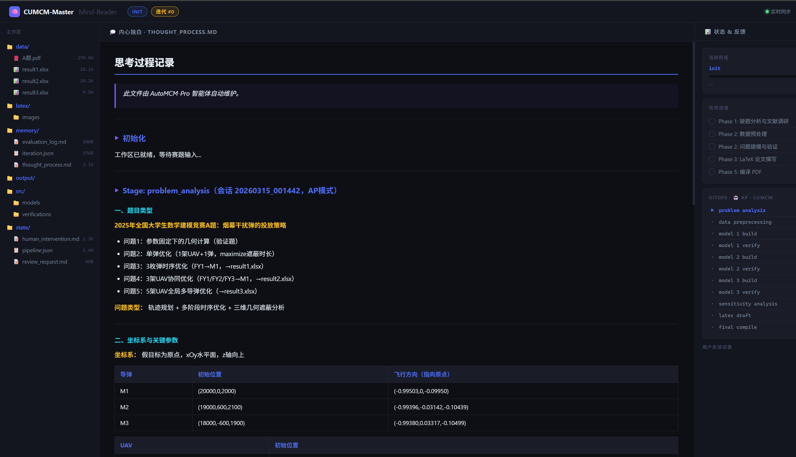
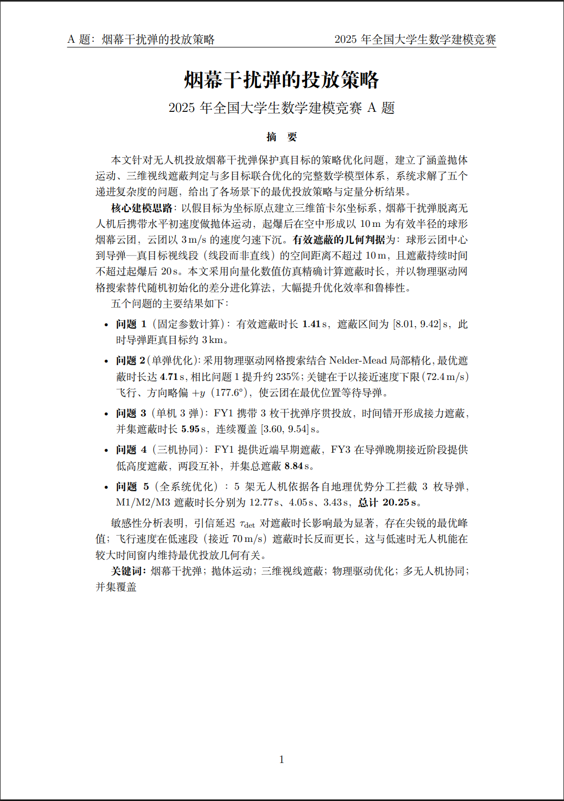

# AutoMCM-Pro

> 重新定义人机协作边界：Claude Code 担任 Autopilot（自动驾驶仪），人类担任 Copilot

[](https://claude.ai/code)
[](LICENSE)
[](demo/)
[](CHANGELOG.md)

---

## 动机与愿景

随着生成式人工智能的快速发展，数学建模竞赛中越来越多的环节可以被 AI 承接——文献检索、数学推导、代码实现、LaTeX 排版，乃至完整的论文写作。这一趋势在推动效率提升的同时，也引发了一个根本性问题：

> **当 AI 能够独立完成大部分工作时，"人机协作"的边界应该划在哪里？**

本项目的出发点，正是跨越这条边界的一次试验。

传统模式中，AI 是工具，人类是决策者。参赛者主导所有环节，AI 仅作为 Copilot（副驾驶）辅助执行。**AutoMCM-Pro 反转了这个关系**：Claude Code 智能体承担 **Autopilot（自动驾驶仪）** 的角色，自主驱动整条建模流水线——从解读赛题、搜索文献、构建数学模型、编写并自证求解代码，到最终生成完整的 LaTeX 论文；**人类退居 Copilot 位置**，在关键节点介入审阅、提供战略性指导，或在需要时完全接管某个环节的决策权。

这种模式并非让人类"袖手旁观"，而是将人类的精力集中在 AI 难以替代的部分：
- **判断建模方向是否符合题意与现实物理**
- **发现模型假设中的潜在缺陷**
- **提供领域直觉与经验性修正**

  

---

## 这个 Skill 能做什么

`/auto-mcm`、`/cumcm-master` 和 `/mcm-master` 三个 Skill 共同构成一条从零到论文的全自动建模流水线，覆盖：

| 阶段 | AI 完成的工作 |
|------|--------------|
| **题目解读** | 读取 PDF/文本题目，识别问题类型、约束、数据特征 |
| **文献调研** | 联网搜索相关建模方法，提炼文献依据，记录 DOI |
| **数据预处理** | 编写并运行 EDA 脚本，生成数据分布图，完成缺失值/异常值处理 |
| **模型构建** | 选择数学工具（优化/微分方程/统计/图论），编写求解代码，运行至无误 |
| **强制自证** | 为每个求解脚本配写独立验证脚本，覆盖约束满足、物理合理性、数值稳定性 |
| **敏感性分析** | 分析关键参数扰动对结果的影响，验证模型鲁棒性 |
| **LaTeX 论文** | 按竞赛格式（国赛/美赛模板）逐章撰写，插入图表，完成引用 |
| **PDF 编译** | 调用 xelatex/pdflatex 编译，输出最终 PDF |
| **AI 图像生成** | 调用 OpenAI gpt-image-2 生成算法流程图、架构图和概念插图（需 API Key 或 Codex 订阅） |

整个过程完全在本地运行，所有中间状态通过 `state/pipeline.json` 持久化，支持中断续做。

---

## AP / MANUAL 双模式

### AP 模式（Autopilot — 自动驾驶）

AI 完全自主推进，每个阶段完成后立即写入自评报告并自动前进到下一阶段。人类可随时查看 `state/review_request.md` 中的自评记录，但不需要主动操作。

**适用场景**：时间紧迫时快速出解，或对 AI 能力充分信任的情况。

### MANUAL 模式（手动规格驱动）

AI 在开始核心建模之前会暂停，等待人类在 `human_intervention.md` 中填写精确的数学规格（模型类型、决策变量、目标函数、约束条件、求解器）。之后 AI 100% 按照该规格实现，不自行添加任何内容。每个阶段完成后同样需要人类填写 `[APPROVED]` 才能继续。

**适用场景**：人类已有明确建模思路，需要精确控制模型细节；或希望对每个阶段保持严格的人工审核。

### 混用策略

两种模式可在同一次竞赛中组合使用：数据预处理阶段用 AP 快速完成，核心建模阶段切换至 MANUAL 确保数学严谨性。

---

## 核心机制

### GitOps 流水线状态机

每个阶段的状态通过 `state/pipeline.json` 持久化，形成类似 CI/CD 的审查流程：

```
not_started → in_progress → pending_review → approved
                                           ↘ rework → in_progress（重做）
```

可随时运行 `python scripts/pipeline_manager.py status` 查看完整状态看板。

### 强制代码自证（Mandatory Self-Verification）

所有求解代码（`src/models/`）都必须配有对应的验证脚本（`src/verifications/verify_*.py`）。验证内容包括：
- 目标函数值与约束满足性核验
- 边界条件与物理可行性检查
- 数值稳定性与收敛性验证

**所有验证项必须全部通过（`✓ PASS`），结果才能被引用进论文。** 任何 `✗ FAIL` 都会强制回退到模型构建阶段。

### Mind-Reader 实时思维可视化

基于 FastAPI + WebSocket 的实时 Web UI（`http://localhost:8080`），渲染 AI 在 `memory/thought_process.md` 中记录的推理过程，支持 KaTeX 数学公式、代码高亮和流水线进度看板。


### AI 图像生成（`/draw-image`）

v0.2.0 新增 `/draw-image` Skill，调用 OpenAI **gpt-image-2** 为论文自动生成流程图、系统架构图和概念插图。该 Skill 仅用于**非数值内容**的图像——数据驱动的图表仍由 Python 代码生成，以保证可重现性。

**默认行为**（无需任何配置即可判断）：

| 环境 | 行为 |
|------|------|
| 已安装 OpenAI Codex 并 OAuth 登录 | ✅ **自动开启** — 通过 `$imagegen` 生成，不消耗 API 额度 |
| 设置了 `OPENAI_API_KEY` | ✅ 开启 — 通过 OpenAI API 生成（按 token 计费） |
| 两者均未配置 | ⏭ **默认关闭** — 自动跳过，LaTeX 留占位符，**流水线不中断** |

> 使用 Codex（ChatGPT Plus/Pro 订阅）时，图像生成无需任何额外配置，**开箱即用**。  
> 未使用 Codex 时，功能默认关闭——不会报错，只是在论文中留下 `\missingfigure{}` 占位符。

```bash
# 检查当前认证状态（不产生任何费用）
python scripts/draw_image.py --check

# 生成一张算法流程图
python scripts/draw_image.py \
  --prompt "Clean flowchart: 读取题目 → 建模 → 验证 → LaTeX, white background" \
  --output CUMCM_Workspace/latex/images/fig00_pipeline.png \
  --quality high
```

### 多 Agent 并行流水线

初始化时加 `--problems N` 即可开启 AP 模式多 Agent 并行。流水线在 `data_preprocessing` 完成后自动判断并行时机，无需手动干预：

```bash
# 开启 AP 多 Agent 并行（3 个子问题）
python scripts/pipeline_manager.py init --mode AP --contest CUMCM --problems 3

# 流水线自动在正确时机建议并行阶段
python scripts/pipeline_manager.py suggest-parallel
# 输出示例：model_1_build model_2_build model_3_build
```

主 Agent 拿到 `suggest-parallel` 的输出后，在**同一条消息**里同时启动 N 个子 Agent，各自负责一个子问题的完整 build → verify → self-approve 流程，彼此完全独立。全部完成后主 Agent 通过 `parallel-all-done` 检查，再进入灵敏度分析。

手动控制命令（也可直接使用）：
```bash
python scripts/pipeline_manager.py parallel-start    model_1_build model_2_build model_3_build
python scripts/pipeline_manager.py parallel-status   model_1_verify model_2_verify model_3_verify
python scripts/pipeline_manager.py parallel-all-done model_1_verify model_2_verify model_3_verify
```

### 竞赛工作区版本控制

初始化时加 `--git` 后，流水线在每次 `advance`（阶段通过）时自动提交快照，支持多轮迭代历史追踪与草稿对比：

```bash
# 开启版本控制 + 多 Agent 并行（3 个子问题）
python scripts/pipeline_manager.py init --mode AP --contest CUMCM --choice A --problems 3 --git

# 查询历史 / 对比草稿
python scripts/pipeline_manager.py contest-git log
python scripts/pipeline_manager.py contest-git diff draft-v1 draft-v2
python scripts/pipeline_manager.py contest-git status
python scripts/pipeline_manager.py contest-git tag final-v2 "第二轮修改后最终版"
```

竞赛 Git 仓库位于 `CUMCM_Workspace/.git`，与 AutoMCM-Pro 工具仓库完全独立。  
`latex_draft` approved → 自动打 `draft-v1` tag；`final_compile` approved → 自动打 `final-v1` tag。

---

## 如何使用

### 第一步：安装 Skill（一次性）

```bash
git clone https://github.com/RealSeaberry/AutoMCM-Pro
cd AutoMCM-Pro
bash install.sh
```

安装完成后，`/auto-mcm`、`/cumcm-master`、`/mcm-master` 三个命令在任意目录的 Claude Code 会话中均可使用。

### 第二步：把工作目录拷贝到竞赛目录

```bash
cp -r AutoMCM-Pro /path/to/my-contest-2025
cd /path/to/my-contest-2025
```

> 题目文件和数据不需要提前放置，Agent 会在对话中询问路径。

### 第三步：开口说话即可

```bash
claude        # 启动 Claude Code
/auto-mcm     # 呼叫 Skill
```

**之后全部用自然语言交流，无需输入任何命令行。**

---

#### AP 模式——AI 全自动，零命令交互示例

```
你：这是今年国赛 B 题，题目在 ./problem.pdf，数据在 ./data/ 目录。帮我做。

AI：读取题目中……检测到 3 个子问题，将开启多 Agent 并行建模 + 竞赛版本控制。
    ✓ 工作区已就绪（AP 模式 | 3 并行 Agent | Git 已开启）。开始建模！

    ……（AI 全程自动运行，每完成一个阶段主动汇报）……

    ✓ 数据预处理完成，保留 231 条记录，生成分布图 3 张。
      → 同时启动问题一、二、三建模（3 个 Agent 并行）。

    ✓ 问题一（非线性规划）验证全通过 | 问题二（ODE）验证全通过 | 问题三（回归）验证全通过。
      → 开始灵敏度分析。

    ✓ 论文草稿完成，已提交快照 draft-v1。开始编译 PDF……
      → 最终论文：CUMCM_Workspace/output/final_paper.pdf

你：问题二的模型假设再严格一点，补充一条。

AI：已理解，正在修改问题二的模型假设章节……（rework 自动执行）
    ✓ 修改完成，已重新编译。版本快照：final-v2。
```

---

#### MANUAL 模式——每步等你拍板，也是自然语言

```
你：MANUAL 模式，我想控制每步的建模细节。

AI：好的，我先读题……数据预处理完成。问题一我计划用 SLSQP 非线性规划，
    目标函数 max T_shield(θ,v)，你确认吗？还是有其他想法？

你：把约束改成 v ∈ [80, 130]。

AI：明白，已更新约束。开始编码……（后续相同）
```

---

## Demo：2025年国赛A题（几乎零干预输出）

> **说明**：以下演示中，流水线全程在 AP（Autopilot）模式下自动运行。人类的全部输入只有以下 5 条提示词。我们认为这是一个接近零干预的基线输出——通过更多的战略性干预，完全可以获得质量更高的论文。

### 全部人类输入（按时间顺序）

**流水线进行中（problem_analysis 阶段完成后）：**

1. `[APPROVED]`
   *（确认 AI 对题目的理解正确，同意继续数据预处理）*

2. `[APPROVED]`
   *（确认数据预处理方案，同意进入建模阶段）*

**流水线完成后（所有 11 个阶段均已 AI 自动推进完毕）：**

3. `请增加更多的图表和可视化，并且确保可视化的中文文字都能正确显示`

4. `能否编译成pdf`

5. `请在论文中增加描述性的语言，增加文字长度。请美化可视化。修改后再次编译`

---

流水线共运行约 **1小时34分钟**，完成 11 个流水线阶段，通过 144 项代码验证，全程 AI 自动推进（仅前两条为流水线内必要的人工确认节点）。

具体建模过程、思考链、生成图表和最终论文详见 [`demo/`](demo/) 目录。**建议直接阅读 `demo/CUMCM_Workspace/latex/main.tex`（或编译后的 PDF）和 `demo/CUMCM_Workspace/memory/thought_process.md`，感受 AI 的完整推理过程。**



---

## 安装

### 前置条件

- [Claude Code](https://claude.ai/code) 已安装（`claude` CLI 可用）
- Python 3.10+
- 基础依赖：`pip install pdfplumber scipy numpy matplotlib pandas openpyxl`
- 可选：TeX Live 或 MiKTeX（LaTeX 编译，也可用 Docker 替代）
- 可选（AI 图像生成）：`pip install openai>=1.0` + `OPENAI_API_KEY` 环境变量，或 OpenAI Codex 订阅

### 安装命令

```bash
git clone https://github.com/RealSeaberry/AutoMCM-Pro
cd AutoMCM-Pro
bash install.sh          # 符号链接安装（推荐，git pull 自动更新）
bash install.sh --copy   # 文件拷贝安装（无 git 环境）
bash install.sh --check  # 检查安装状态
```

### 更新

```bash
cd AutoMCM-Pro
git pull   # 符号链接安装下，Skill 自动生效，无需重装
```

### 卸载

```bash
bash uninstall.sh
```

---

## 项目结构

```
AutoMCM-Pro/
├── .claude/skills/
│   ├── auto-mcm/SKILL.md        # 统一入口（AP/MANUAL 双模式，含多 Agent 并行策略）
│   ├── cumcm-master/SKILL.md    # 国赛专用
│   ├── mcm-master/SKILL.md      # 美赛专用
│   └── draw-image/SKILL.md      # AI 图像生成（gpt-image-2，含 Codex OAuth 支持）
├── AutoMCM_SOP.md               # 操作准则（Skill 行为的最终权威）
├── CHANGELOG.md                 # 版本变更记录
├── install.sh / uninstall.sh    # 安装/卸载
├── init_gitops.sh               # 交互式初始化引导
├── docker-compose.yml           # 容器化环境（Python + TeX Live）
├── scripts/
│   ├── pipeline_manager.py      # GitOps 状态机 CLI（含 suggest-parallel/parallel/contest-git）
│   ├── contest_git.py           # 竞赛工作区版本控制（CUMCM_Workspace/.git）
│   ├── draw_image.py            # OpenAI gpt-image-2 图像生成（含 Codex 认证检测）
│   ├── compile_pdf.py           # 跨平台 LaTeX 编译（Python）
│   ├── setup_workspace.py       # 工作区目录初始化
│   └── agent_memory_manager.py  # 记忆管理工具
├── templates/
│   ├── latex_template.tex       # CUMCM 论文模板（10节中文格式）
│   ├── mcm_template.tex         # MCM/ICM 论文模板（mcmthesis）
│   └── mcm_memo_template.tex    # MCM 实用性文件模板（单页 Memo）
├── demo/                        # 2025国赛A题完整演示产物
└── CUMCM_Workspace/             # 运行时工作目录（每次竞赛独立拷贝）
    ├── data/                    # 赛题与数据文件
    ├── src/models/              # 求解代码
    ├── src/verifications/       # 验证脚本（强制配套）
    ├── latex/                   # LaTeX 源文件与图表
    ├── memory/                  # 思考过程与推理链
    ├── state/                   # GitOps 流水线状态
    └── output/                  # 最终 PDF 与结果表格
```

---

## LaTeX 编译

```bash
# 本地编译（需已安装 TeX Live 或 MiKTeX）
python scripts/compile_pdf.py                    # CUMCM
python scripts/compile_pdf.py --mode mcm --memo  # MCM + Memo

# Docker 编译（无需本地 LaTeX）
docker-compose up -d cumcm-agent
docker exec -it cumcm-agent python scripts/compile_pdf.py
```

---

## License

MIT License — 欢迎 Fork、二次开发和 Pull Request。

---
---

# AutoMCM-Pro

> Redefining Human-AI Collaboration: Claude Code as Autopilot, Humans as Copilot

---

## Motivation

As generative AI rapidly advances, an increasing share of math modeling competition tasks can be delegated to AI: literature search, mathematical derivation, code implementation, LaTeX typesetting, and even full paper writing. This raises a fundamental question:

> **When AI can independently handle most of the work, where should the boundary of human-AI collaboration be drawn?**

AutoMCM-Pro is an experiment in crossing that boundary.

In the traditional model, AI is a tool and humans are decision-makers. Competitors lead every step, with AI acting as a Copilot. **AutoMCM-Pro inverts this relationship**: the Claude Code agent takes the **Autopilot** role, autonomously driving the entire modeling pipeline — from interpreting the problem, searching literature, building mathematical models, writing and self-verifying solver code, to generating the complete LaTeX paper. **Humans step into the Copilot seat**, intervening at key checkpoints to review, provide strategic guidance, or take full control of specific decisions when needed.

This is not about humans "stepping aside." It's about concentrating human effort where it's irreplaceable:
- Judging whether the modeling direction aligns with the problem's intent and physical reality
- Spotting flaws in model assumptions
- Providing domain intuition and empirical corrections

---

## What This Skill Does

Three Skills — `/auto-mcm`, `/cumcm-master`, and `/mcm-master` — form a complete zero-to-paper automated pipeline:

| Stage | What the AI Does |
|-------|-----------------|
| **Problem Reading** | Reads PDF/text problem, identifies problem type, constraints, data characteristics |
| **Literature Research** | Searches the web for relevant modeling methods, extracts references |
| **Data Preprocessing** | Writes and runs EDA scripts, generates distribution plots, handles missing/outlier values |
| **Model Building** | Selects mathematical tools (optimization/ODE/statistics/graph theory), writes solver code |
| **Self-Verification** | Writes an independent verification script for each solver: constraints, physical feasibility, numerical stability |
| **Sensitivity Analysis** | Analyzes how key parameter perturbations affect results, validates robustness |
| **LaTeX Paper** | Writes chapter by chapter in competition format (CUMCM or MCM template), inserts figures, completes citations |
| **PDF Compilation** | Compiles with xelatex/pdflatex, outputs the final PDF |
| **AI Image Generation** | Uses OpenAI gpt-image-2 to generate algorithm flowcharts, architecture diagrams, and conceptual illustrations (requires API Key or Codex subscription) |

The entire process runs locally. All intermediate state is persisted via `state/pipeline.json`, supporting pause and resume.

---

## AP / MANUAL Dual Modes

### AP Mode (Autopilot)

The AI runs fully autonomously, completing each stage and then immediately writing a self-evaluation report and advancing to the next stage. Humans can review `state/review_request.md` at any time but are not required to act.

**Best for**: Time-constrained competitions, rapid prototyping, or when you trust the AI to handle the full run.

### MANUAL Mode (Specification-Driven)

Before starting core modeling, the AI pauses and waits for the human to fill in a precise mathematical specification in `human_intervention.md` (model type, decision variables, objective function, constraints, solver). The AI then implements exactly that specification — no autonomous extensions. Each stage also requires a human `[APPROVED]` to continue.

**Best for**: When you have a clear modeling strategy and want precise control; or when you want strict human review at every checkpoint.

### Mixing Modes

The two modes can be combined within a single competition: AP mode for fast data preprocessing, then MANUAL for the critical modeling stages.

---

## Core Mechanisms

### GitOps Pipeline State Machine

Each stage's status is persisted in `state/pipeline.json`, forming a CI/CD-like review flow:

```
not_started → in_progress → pending_review → approved
                                           ↘ rework → in_progress (redo)
```

Run `python scripts/pipeline_manager.py status` at any time to see the full status dashboard.

### Mandatory Self-Verification

All solver code (`src/models/`) must be paired with a corresponding verification script (`src/verifications/verify_*.py`), covering:
- Objective function value and constraint satisfaction
- Boundary conditions and physical feasibility
- Numerical stability and convergence

**All verification checks must pass (`✓ PASS`) before results can be cited in the paper.** Any `✗ FAIL` forces a rollback to the model-building stage.

### Mind-Reader Real-Time Visualization

A FastAPI + WebSocket web UI at `http://localhost:8080` renders the AI's thought process from `memory/thought_process.md` in real time, with KaTeX math, code highlighting, and a pipeline progress dashboard.

### AI Image Generation (`/draw-image`)

New in v0.2.0: the `/draw-image` skill calls OpenAI **gpt-image-2** to generate flowcharts, architecture diagrams, and conceptual illustrations. It is intentionally limited to **non-data figures** — data-driven charts are still generated by Python code to ensure reproducibility.

**Default behavior** (auto-detected, no configuration needed to know which applies):

| Environment | Behavior |
|-------------|----------|
| OpenAI Codex installed and signed in via OAuth | ✅ **Auto-enabled** — uses `$imagegen`, no API credits consumed |
| `OPENAI_API_KEY` set | ✅ Enabled — uses OpenAI API (token-based billing) |
| Neither configured | ⏭ **Disabled by default** — skips silently, leaves `\missingfigure{}` placeholder, **pipeline continues** |

> If you use Codex (ChatGPT Plus/Pro subscription), image generation works out of the box — **no extra setup required**.  
> Without Codex, the feature is off by default — it never errors out, it just leaves placeholders in your paper.

```bash
python scripts/draw_image.py --check   # check auth without generating anything
```

### Multi-Agent Parallel Pipeline (AP Mode)

Add `--problems N` to `init` to enable automatic AP multi-agent parallelism. The pipeline detects the right moment to parallelize — no manual intervention needed:

```bash
# Enable AP multi-agent parallel for 3 sub-problems
python scripts/pipeline_manager.py init --mode AP --contest CUMCM --problems 3

# Pipeline auto-suggests the next batch of parallel stages
python scripts/pipeline_manager.py suggest-parallel
# Example output: model_1_build model_2_build model_3_build
```

In Claude Code, the orchestrator Agent calls `suggest-parallel` after `data_preprocessing` is approved, then launches N sub-Agents simultaneously in a single message — each handles one sub-problem's complete build → verify → self-approve cycle independently. The orchestrator advances to sensitivity analysis only after `parallel-all-done` exits 0.

Manual control commands (also available for custom orchestration):
```bash
python scripts/pipeline_manager.py parallel-start    model_1_build model_2_build model_3_build
python scripts/pipeline_manager.py parallel-status   model_1_verify model_2_verify model_3_verify
python scripts/pipeline_manager.py parallel-all-done model_1_verify model_2_verify model_3_verify
```

### Contest Workspace Version Control

Add `--git` to `init` to enable an independent Git repo inside `CUMCM_Workspace/` that auto-snapshots at every pipeline stage approval — enabling multi-round draft comparison and rollback:

```bash
# Enable version control + multi-agent parallel (3 sub-problems)
python scripts/pipeline_manager.py init --mode AP --contest CUMCM --choice A --problems 3 --git

# Query history / compare drafts
python scripts/pipeline_manager.py contest-git log
python scripts/pipeline_manager.py contest-git diff draft-v1 draft-v2
python scripts/pipeline_manager.py contest-git tag final-v2 "post-revision final"
```

The `CUMCM_Workspace/.git` repo is fully independent from the AutoMCM-Pro tool repo.  
`latex_draft` approved → auto-tag `draft-v1`; `final_compile` approved → auto-tag `final-v1`.

---

## How to Use

### Step 1: Install (one-time)

```bash
git clone https://github.com/RealSeaberry/AutoMCM-Pro
cd AutoMCM-Pro
bash install.sh
```

After installation, `/auto-mcm`, `/cumcm-master`, and `/mcm-master` are available in any Claude Code session from any directory.

### Step 2: Copy the working directory for your contest

```bash
cp -r AutoMCM-Pro /path/to/my-contest-2025
cd /path/to/my-contest-2025
```

> No need to place files or run any setup commands — the agent asks for file paths in natural language.

### Step 3: Just talk

```bash
claude
/auto-mcm
```

**Everything after this is natural language. No command-line input required.**

---

#### AP Mode — Fully Autonomous, Zero-Command Example

```
You:  This is the CUMCM 2025 Problem B. The PDF is at ./problem.pdf and
      data is in ./data/. Please handle everything.

AI:   Reading the problem… detected 3 sub-problems. Enabling multi-agent
      parallel mode + version control.
      ✓ Workspace ready (AP mode | 3 parallel agents | Git enabled). Starting!

      … (AI runs autonomously, reporting after each stage) …

      ✓ Data preprocessing done — 231 records retained, 3 distribution plots generated.
        → Launching Problems 1, 2, 3 in parallel (3 agents).

      ✓ Problem 1 (NLP) all verifications passed
        Problem 2 (ODE) all verifications passed
        Problem 3 (regression) all verifications passed
        → Starting sensitivity analysis.

      ✓ Draft complete — snapshot tagged draft-v1. Compiling PDF…
        → Final paper: CUMCM_Workspace/output/final_paper.pdf

You:  Tighten the assumptions for Problem 2 — add one more constraint.

AI:   Understood. Updating Problem 2 model assumptions…  (rework runs silently)
      ✓ Done and recompiled. New snapshot: final-v2.
```

---

#### MANUAL Mode — You Approve Each Step, Still in Natural Language

```
You:  MANUAL mode — I want to control the modeling approach.

AI:   Got it. After reading the problem and preprocessing data, here's my
      proposed plan for Problem 1: objective max T_shield(θ,v),
      variables θ∈[0°,360°] and v∈[70,140] m/s, solver SLSQP. Confirm?

You:  Change the speed range to [80, 130].

AI:   Updated. Starting implementation…
```

---

## Demo: CUMCM 2025 Problem A — Near-Zero Intervention

> The pipeline ran in AP (Autopilot) mode throughout. The **complete human input for the entire session** is just the 5 prompts listed below. This is a near-zero-intervention baseline output. With more strategic interventions, significantly higher quality is achievable.

### All Human Inputs (chronological)

**During the pipeline (after `problem_analysis` stage):**

1. `[APPROVED]`
   *(Confirming the AI's problem understanding; allowing data preprocessing to begin)*

2. `[APPROVED]`
   *(Confirming the preprocessing plan; allowing modeling to begin)*

**After the pipeline completed (all 11 stages auto-advanced by AI):**

3. `请增加更多的图表和可视化，并且确保可视化的中文文字都能正确显示`
   *(Add more charts and visualizations; ensure Chinese text renders correctly)*

4. `能否编译成pdf`
   *(Can you compile to PDF?)*

5. `请在论文中增加描述性的语言，增加文字长度。请美化可视化。修改后再次编译`
   *(Add more descriptive language, increase paper length; polish visualizations; recompile)*

---

The pipeline ran for approximately **1 hour 34 minutes**, completing 11 stages and passing 144 verification checks. The first two prompts were necessary approval confirmations within the pipeline; the final three were optional post-pipeline refinements added after the paper was already complete.

For the full thought process, generated figures, and the final paper, see the [`demo/`](demo/) directory. We recommend reading `demo/CUMCM_Workspace/memory/thought_process.md` and the compiled PDF to experience the AI's complete reasoning chain.

---

## Installation

### Prerequisites

- [Claude Code](https://claude.ai/code) installed
- Python 3.10+
- `pip install pdfplumber scipy numpy matplotlib pandas openpyxl`
- Optional: TeX Live or MiKTeX (or use Docker)
- Optional (AI image generation): `pip install openai>=1.0` + `OPENAI_API_KEY`, or an OpenAI Codex subscription

### Install

```bash
git clone https://github.com/RealSeaberry/AutoMCM-Pro
cd AutoMCM-Pro
bash install.sh          # symlink install (recommended — git pull auto-updates)
bash install.sh --copy   # copy install (for non-git environments)
bash install.sh --check  # check installation status
```

### Update

```bash
git pull   # symlink install: Skills update automatically
```

### Uninstall

```bash
bash uninstall.sh
```

---

## License

MIT License — Fork, extend, and contribute pull requests welcome.
